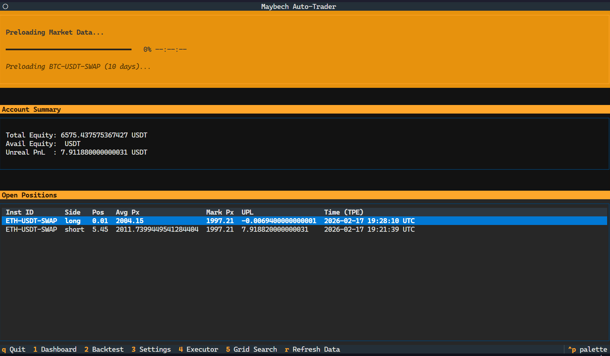

<div align="center">

# 🌊 Maybech

**The Next-Generation Automated Crypto Trading & Market Tracking Framework**

[](https://www.python.org/downloads/)
[](https://textual.textualize.io/)
[](https://www.okx.com/)

*A sleek, high-performance command center built for the modern quantitative trader.*

</div>

---

## 🎯 Project Vision

Maybech is more than just a trading bot—it's a commitment to technical excellence in quantitative finance. Built to bridge the gap between complex market data and actionable, automated strategies, it stands as a robust showcase of software engineering and market analysis.

Whether you're tracking violent market swings instantly, developing fluent trading strategies, or backtesting ideas, Maybech brings it all together under a graceful, terminal-based interface (TUI). It is designed to eliminate emotional bias, maximize execution efficiency, and bring enterprise-grade market awareness directly to your terminal.



---

## ✨ Core Highlights

### 🕹️ Graceful Terminal UI (TUI)
Manage the chaos of the crypto markets with elegance. Powered by **Textual**, the TUI provides a visual, real-time command center:
- **Live Strategy Monitoring**: Track auto-execution status (● RUNNING, ○ STALE) with visual polling indicators.
- **Progressive UI**: See real-time metrics, backtest progress bars, and streaming system logs directly in your terminal without ever leaving the keyboard.

### ⚡ Instant Market Tracking & AutoTrader
Never miss a beat in the market.
- **Fluent Strategy Development**: Craft complex quantitative strategies leveraging Pandas and TA-Lib with ease.
- **Auto-Strategy Executor**: Deploy your logic into the live market. The engine handles real-time signal generation, 1:1 Risk/Reward validation, conservative outcome handling, and zero-hesitation execution via the OKX API.

### 📡 Real-Time Intelligent Notifications
Stay connected, no matter where you are.
- **Instant Alerts**: Receive immediate **LINE Bot** pushes (and soon Email) whenever the market experiences severe fluctuations or critical price proximity events.
- **Actionable Intel**: Get notified of instant trade entries, take-profits, and stop-losses directly to your mobile device, in beautifully formatted Traditional Chinese.

### 🔬 High-Fidelity Backtest Engine & Optimizer
Prove it before you trade it.
- **Rigorous Simulation**: Validate strategies against comprehensive historical OHLCV data with precision.
- **Grid Search Optimizer**: Run multi-dimensional parameter discovery (e.g., K-Long, K-Short, Gap Thresholds) with automated scoring and ranking to find the absolute mathematically optimal configuration.
- **Smart Data Caching**: Intelligent incremental fetching perfectly respects API rate limits while serving repeated backtests instantly from persistent cache.

---

## 🛠 Tech Stack

*   **Core**: Python 3.13 recommended (`>=3.11,<3.15` supported)
*   **User Interface**: [Textual](https://github.com/Textualize/textual) for a reactive, CSS-driven modern terminal experience
*   **Data & Analysis**: Pandas, NumPy, TA-Lib for lightning-fast quantitative analysis
*   **Exchange Layer**: [OKX API v5](https://www.okx.com/docs-v5)
*   **Ecosystem**: [uv](https://github.com/astral-sh/uv) (Extremely fast Python package installer and virtual environment resolver)

---

## 📦 Installation & Setup

We strictly use `uv` for blazing-fast project management. Python 3.13 is the recommended runtime for this project because it is stable, broadly supported by package wheels, and avoids dependency lag on the newest CPython releases. The project metadata supports Python `>=3.11,<3.15`.

Install `uv` on Windows PowerShell:

```powershell
powershell -ExecutionPolicy ByPass -c "irm https://astral.sh/uv/install.ps1 | iex"
```

Then restart the shell and confirm:

```powershell
uv --version
```

1.  **Clone the Repository**:
    ```bash
    git clone https://github.com/egger-meow/maybech.git
    cd maybech
    ```

2.  **Setup Environment (Strictly via UV)**:
    ```bash
    # Install the recommended Python if missing
    uv python install 3.13

    # Create a local virtual environment using Python 3.13
    uv venv --python 3.13
    
    # Activate (Windows)
    .venv\Scripts\activate 
    
    # Install dependencies instantly
    uv pip install -r requirements.txt
    ```

3.  **Configuration**:
    Create a `.env` file based on `.env.example`. Add your OKX API credentials and LINE Messaging API tokens.
    Customize parameters for market trackers in `src/config/notificator_config.json`.

4.  **Launch the Command Center**:
    ```bash
    uv run python run_services.py
    ```

5.  **Launch the Local Runtime API**:
    ```bash
    uv run python run_api.py
    ```
    The API starts the daemon services and exposes service state at
    `http://127.0.0.1:8000/services`, recent runtime events at
    `http://127.0.0.1:8000/events`, position intents at
    `http://127.0.0.1:8000/position/intents`, and a live event stream at
    `ws://127.0.0.1:8000/ws/events`.

6.  **Optional Always-On Deployment**:
    See `docs/deployment.md` for Windows Task Scheduler and Docker Compose
    setup notes.

## Runtime Tracking

Use `docs/runtime-status.md` as the source of truth for local API endpoints,
service status keys, account snapshot fields, and live-trading safety limits.
Keep `toImprove.md` updated with at least three active improvement priorities.

---

<div align="center">
<i>Developed with precision for the future of decentralized finance. Built to impress, engineered to perform.</i>
</div>
