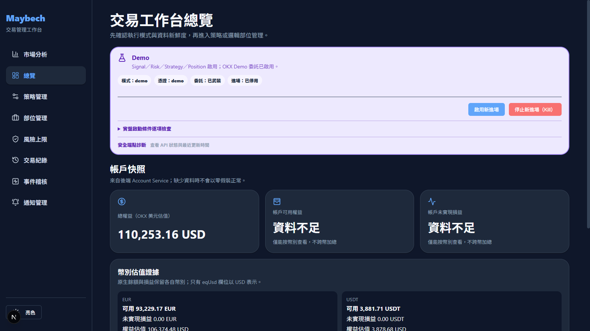
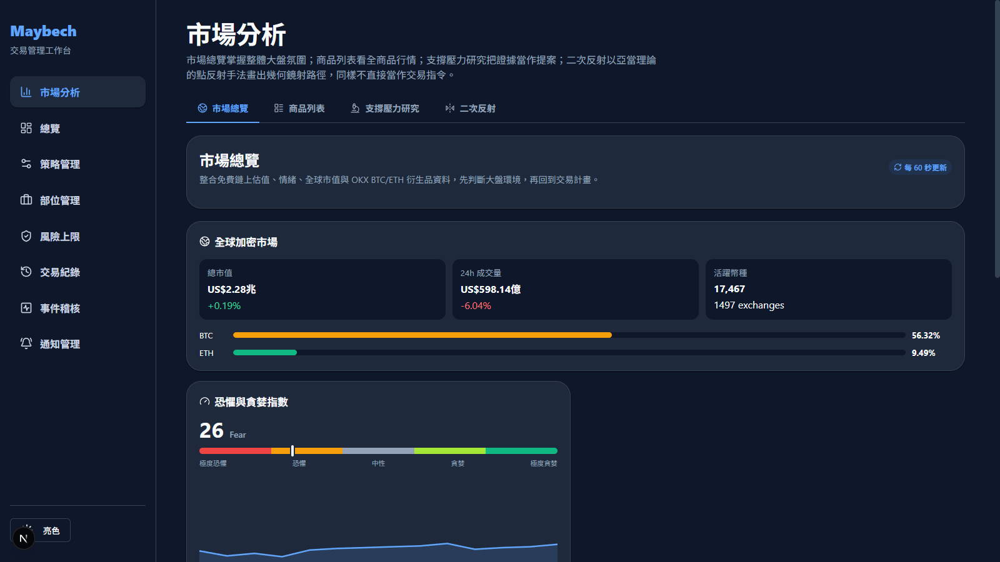
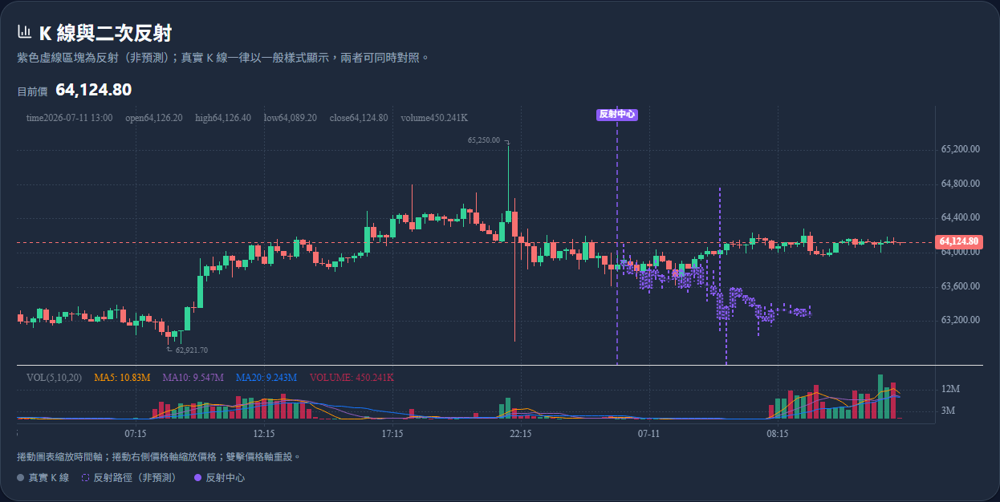
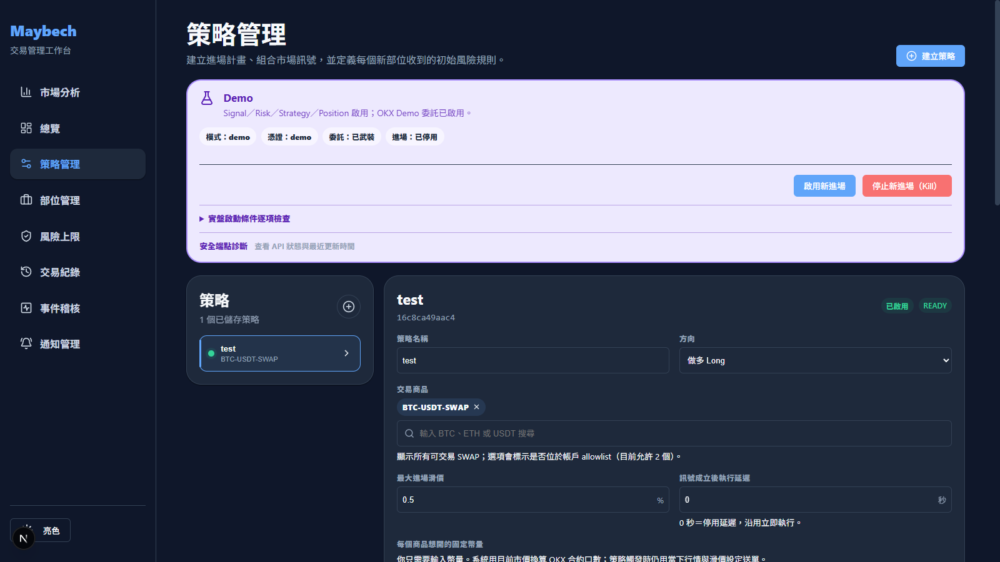
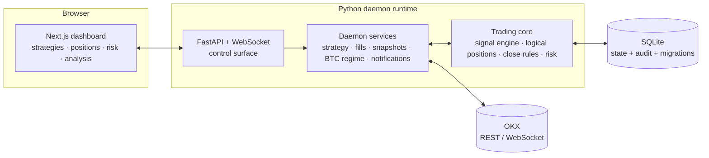

<div align="center">

# Maybech

**Signal-driven trading workspace for OKX perpetuals — local-first, fail-closed, operator in command.**

[](https://github.com/egger-meow/maybech/releases)
[](LICENSE)
[](pyproject.toml)
[](src/api)
[](frontend)
[](docs/storage.md)
[](docs/runtime-status.md)



</div>

---

Maybech is **not** an autonomous trading bot. It is an **operator-assist system**: a
Python daemon runtime plus a Next.js dashboard that watches markets, evaluates
persisted signal strategies, manages every position as an independently-ruled unit,
and refuses to touch real money until you explicitly, repeatedly tell it to.

Everything runs on your machine. State lives in SQLite. The default runtime mode
is `simulation` — it cannot even connect to an exchange.

## Why Maybech

- **Logical position units, not raw exchange positions.** OKX merges repeated
  same-side entries into one position; Maybech tracks each entry as its own unit
  with its own stop-loss, take-profit, break-even, and reduce rules.
- **Fail-closed by design.** Startup disarms orders first, takes an OS-held lock on
  the database (and, in live mode, on the OKX account scope), runs a preflight of
  strategy/instrument/risk checks, and only arms order placement if every gate
  passes. Any startup error disarms and releases everything before re-raising.
- **Confirmed fills are the source of truth.** Even in armed live mode, a triggered
  close submits a reduce-only order and the unit stays `closing` until an
  authenticated OKX fill confirms it. No optimistic state.
- **Every decision is auditable.** Each signal edge becomes a durable
  `strategy.action_decision` record — direction, strength, entry price,
  allow/block reason, evidence, correlation id — queryable via the API.
- **BTC regime as a first-class input.** BTC market state gates entries on every
  pair; it is treated as a risk signal, not just another chart.

## Screenshots

| Market macro overview | Adam Theory reflection research |
| --- | --- |
|  |  |

| Strategy management |
| --- |
|  |

> The dashboard UI is currently in Traditional Chinese (繁體中文); the backend,
> API, and all documentation are in English.

## Who is this for

- **Discretionary OKX perp traders** who want rule-driven exits and guarded entries
  without handing their account to a black-box bot.
- **Quant-minded builders** who want a local-first, auditable execution stack they
  can read, extend, and trust — no cloud, no telemetry, no custody.
- **Engineers** looking for a working reference of fail-closed trading safety:
  preflight gates, credential-namespace isolation, single-writer runtime leases,
  idempotent fill allocation, versioned SQLite migrations.

It is **not** for plug-and-play "profit bots", HFT, or unattended real-money
operation. Simulation-first is a feature, not a limitation.

## Runtime safety model

Exchange connectivity and order permission are **independent axes** — a mode may
connect to production without ever being allowed to submit an order.

| Mode | Connects to exchange | Submits orders | Purpose |
| --- | --- | --- | --- |
| `simulation` *(default)* | ✕ | ✕ | Local dry-run; no credentials needed |
| `demo` | OKX demo | demo orders | Full rehearsal on fake money |
| `live_safe` | production | ✕ | Inspect / recover a real account, read-only |
| `live_armed` | production | gated | Real trading behind explicit arming |

Reaching a real order in `live_armed` requires **all** of: explicit
`--mode live_armed` startup, `MAYBECH_ARM_ORDERS=1`, a passing preflight, enabled
account risk limits, an authenticated private order stream with current fill
catch-up, and a separate operator-confirmed entry-enable call. A kill switch
(`POST /risk/entries/kill`) disables new entries immediately and stays disabled
until explicitly re-enabled — reduce-only closes keep working regardless.

Demo and live use **disjoint credential namespaces** (`DEMO_OKX_*` vs `OKX_*`),
so an endpoint and the wrong credential set can never mix.

## Quickstart

Prerequisites: [uv](https://docs.astral.sh/uv/), Node.js 18+, and (optionally)
OKX API keys for demo/live modes — simulation needs none.

**Backend** (Python 3.13 recommended):

```powershell
uv python install 3.13
uv venv --python 3.13
uv pip install -r requirements.txt

uv run python -m src.runtime api              # simulation (default, no exchange)
uv run python -m src.runtime api --mode demo  # OKX demo environment
```

The API binds to `http://127.0.0.1:8000` (loopback only by default).

**Dashboard:**

```powershell
cd frontend
npm install
npm run dev   # http://localhost:3000
```

**Tests and quality gates:**

```powershell
uv run pytest                  # backend suite
cd frontend; npm run verify    # contract + lint + typecheck + build
```

Copy `.env.example` to `.env` for OKX / LINE / email integration settings. Never
commit `.env`; keep the API on loopback unless you have configured
authentication, TLS, and a private access path (see [Security](#security)).

## Architecture



```
src/
├── runtime/    CLI, mode resolution, live preflight, SQLite lease, API entrypoint
├── daemon/     long-running services and the scheduler/registry
├── api/        FastAPI endpoints and Pydantic schemas
├── trading/    signal engine, strategies, logical positions, rules, risk, stores
├── exchange/   OKX REST/WebSocket access
├── market/     BTC regime and market analysis
├── data/       candle storage and indicators
└── notifications/  LINE / email alert delivery
frontend/       Next.js dashboard (typed against the generated OpenAPI contract)
```

## Documentation

| Doc | What it covers |
| --- | --- |
| [docs/project-charter.md](docs/project-charter.md) | Product goals and philosophy |
| [docs/domain-model.md](docs/domain-model.md) | Logical position units, rules, strategy model |
| [docs/system-direction.md](docs/system-direction.md) | Target architecture and refactor direction |
| [docs/runtime-status.md](docs/runtime-status.md) | API payloads, service status keys, live safety limits |
| [docs/storage.md](docs/storage.md) | SQLite schema, migrations, persistence rules |
| [docs/deployment.md](docs/deployment.md) | Operational setup and verification path |
| [CHANGELOG.md](CHANGELOG.md) | Release history |

## Roadmap

- Backtesting as a first-class strategy-management capability (no fake API until
  a real engine exists).
- PostgreSQL + distributed leader routing for multi-host deployments (SQLite
  read replicas are already database-enforced read-only, same-host).
- Richer notification reliability (delivery health, retry policy) when it
  becomes a priority.

The live priority queue for real-money-safety work is tracked in
[toImprove.md](toImprove.md) — it is an ordered contract, not a wishlist.

## Security

- Secrets live in `.env` (from `.env.example`); a source-derived test rejects
  missing and obsolete entries. Treat OKX keys, LINE tokens, and SMTP
  credentials as sensitive.
- The API refuses non-loopback binding unless both `--allow-remote` and
  `MAYBECH_API_TOKEN` are set; bearer auth alone does not encrypt traffic — put
  TLS at a reverse proxy or use a private tunnel.
- The test suite never enables production order mutation; opt-in OKX
  integration tests are read-only and require explicit environment flags.

## Contributing

Issues and pull requests are welcome. Start with [AGENTS.md](AGENTS.md) for repo
conventions (structure, style, testing, commits) and run the quality gates
(`uv run pytest`, `cd frontend && npm run verify`) before submitting.

If Maybech is useful or interesting to you, **a ⭐ star helps the project a lot**.

[](https://github.com/egger-meow/maybech/stargazers)

## Disclaimer

Maybech is alpha software (`v0.1.0-alpha.1`) for research and operator-assisted
trading. It is not financial advice, and no part of it promises profitability or
bounded losses. Trading perpetual futures is extremely risky — test in
`simulation` and `demo` modes first, and never arm live trading with money you
cannot afford to lose.

## License

[MIT](LICENSE) © 2026 egger-meow
