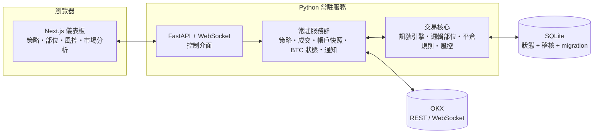

<div align="center">

# Maybech

**訊號驅動的 OKX 永續合約交易工作台 — 本機優先、預設關閉、操作者全權掌控。**

[English](README.md) | **繁體中文**

[](https://github.com/egger-meow/maybech/releases)
[](LICENSE)
[](pyproject.toml)
[](src/api)
[](frontend)
[](docs/storage.md)
[](docs/runtime-status.md)


</div>

---

Maybech **不是**自動交易機器人，而是一套「操作者輔助系統」：由 Python 常駐服務
搭配 Next.js 儀表板組成，負責監控市場、評估已持久化的訊號策略、把每一筆進場都
當成獨立部位單元來管理規則，並且在你明確、反覆確認之前，絕不會動用真實資金。

一切都在你自己的機器上執行，狀態儲存在本機 SQLite。預設的執行模式是
`simulation`（模擬）——這個模式甚至無法連上交易所。

## 為什麼選擇 Maybech

- **邏輯部位單元，而非交易所原始部位。** OKX 會把同方向的多次進場合併成單一
  部位；Maybech 則將每一次進場都視為獨立單元，各自擁有停損、停利、移動保本、
  減倉等規則。
- **預設關閉（fail-closed）的架構。** 啟動流程一律先解除下單武裝，取得資料庫
  的作業系統層級鎖（實盤模式下也會鎖定 OKX 帳戶範圍），跑完策略／商品／風控
  的啟動前檢查，唯有所有關卡都通過才會武裝下單權限。啟動過程中任何例外都會先
  解除武裝、釋放所有資源，才會重新拋出錯誤。
- **已確認成交才是真相來源。** 即使在武裝的實盤模式下，觸發的平倉也只會送出
  只減倉（reduce-only）委託單；部位單元會停留在 `closing` 狀態，直到收到已驗證
  的 OKX 成交回報為止，不存在樂觀式的狀態更新。
- **每個決策都有稽核紀錄。** 每一次訊號由否轉是的邊界事件，都會產生一筆
  持久化的 `strategy.action_decision` 紀錄——方向、強度、進場價、允許／阻擋
  原因、佐證資料、關聯 ID——皆可透過 API 查詢。
- **BTC 市場狀態是第一級輸入訊號。** BTC 的市場狀態會作為每個交易對進場的
  關卡條件，被視為風險／狀態訊號，而不只是另一張圖表。

## 畫面截圖

| 全市場總覽 | 亞當理論二次反射研究 |
| --- | --- |
|  |  |

| 策略管理 |
| --- |
|  |

> 儀表板介面目前為繁體中文；後端、API 與所有文件則以英文撰寫。

## 訊號（Signals）

「訊號」是一個小型、有型別的 JSON 條件——不是黑盒子評分。每個訊號都是六種
基礎型別之一，各自對照即時市場資料判斷：

| 型別 | 觸發時機 |
| --- | --- |
| `price_above` / `price_below` | 價格穿越某個門檻 |
| `rapid_rise` / `rapid_drop` | 價格在一段時間窗內變動 ≥ N% |
| `volume_multiple` | 目前成交量 ≥ 某時間週期基準量的 N 倍 |
| `boundary_approach` | 價格接近某個支撐／壓力位、在容許誤差內，但尚未實際穿越 |

基礎條件可用 `and` / `or` / `not` 組合成一棵條件樹，可以任意巢狀。策略的
進場訊號，以及每一條平倉規則（停損、停利、移動保本、移動停利），本質上都是
這樣的一棵樹。舉例來說，一個 ETH 策略的進場訊號，要求「自身短線突破」*且*
「BTC 也突破某個價位」：

```json
{
  "op": "and",
  "conditions": [
    { "type": "price_above", "symbol": "BTC-USDT-SWAP", "value": 68000 },
    { "type": "rapid_rise", "symbol": "self", "window_seconds": 300, "change_pct": 1.5 }
  ]
}
```

`symbol` 可以是 `"self"`（策略自身交易的商品），也可以是任何其他 OKX 商品
代碼——跨商品條件並不是特殊情況，只是同一棵樹裡的另一個節點。策略訊號每一次
由否轉是的邊界，都會在送出任何委託之前，先被持久化記錄成一筆
`strategy.action_decision`——包含方向、佐證資料、允許／阻擋原因——可透過
`GET /strategy/decisions` 查詢。

## 交易邏輯：BTC 帶動全市場

山寨幣的走勢絕大多數時候都跟著 BTC 走——「只有在 BTC 也突破壓力位時，才
買進 ETH 的突破」是大多數永續合約交易者早已憑直覺在用的判斷法則。Maybech
把這個判斷邏輯變得明確、可組合、可稽核，而不是留在交易者腦中，透過兩個
彼此獨立的層次來實現：

1. **作為訊號條件，可自由選用。** 如上所示，任何策略都能在進場或平倉規則的
   條件樹中，直接引用另一個商品的價格、變動速度或成交量。「BTC 突破壓力位後
   才做多 ETH」，就只是一個 `self` 條件與一個 `BTC-USDT-SWAP` 條件的
   `and` 組合——由每個策略自行組成，而不是寫死在程式裡的特例。
2. **作為市場狀態閘門，永遠啟用。** 不論任何策略組合了什麼條件，
   `BTCRegimeService` 都會持續依據 EMA 趨勢與短窗變動率，將 BTC 分類為
   `direction`（多頭／空頭／中性）×`strength`（強／普通／弱）×`impulse`
   （向上／向下／無）的狀態。在任何策略的進場被實際執行之前——**不論交易的
   是哪個商品**，都會先對照即時的市場狀態：強力空頭狀態或向下衝量會全系統性
   地阻擋所有新的多單進場；反之則阻擋所有新的空單進場。這道閘門的設計上偏向
   保守，策略本身無法透過條件組合繞過；它只能「阻擋」，永遠不會「強制」進場。

實際效果是：你可以把「突破連動」這種判斷法則明確寫成訊號條件，而當這個訊號
真的觸發時，如果當下的 BTC 市場狀態不認同這筆交易方向，Maybech 仍然會拒絕
執行。

## 核心功能

- **策略管理** — 用上述基礎條件組合進場訊號與平倉規則；為每個商品掛上
  已定型的平倉規則預設（停損、停利、移動保本、移動停利）；設定商品白名單、
  最大滑價、訊號成立後的執行延遲；儲存前即可預覽 OKX 合約口數換算結果。
- **部位管理** — 每一次進場都被視為獨立的邏輯單元追蹤，不會與交易所端合併後
  的原始部位混在一起；隨時可以編輯已開部位的停損／停利／移動保本／移動停利
  規則；也能為策略引擎之外開出的部位手動註冊邏輯單元。
- **風險上限** — 帳戶層級的最大單筆委託名目金額、最大總曝險、最大槓桿倍數
  （≤125 倍）、商品白名單，皆在每一筆委託送出前強制檢查；緊急停止可立即
  停用新進場，同時只減倉的平倉功能仍持續運作。
- **市場分析** — 全市場總覽儀表板（恐懼貪婪指數、市值佔比、資金費率）、
  逐商品市場列表、支撐壓力研究，以及亞當理論二次反射工具——用於幾何型態
  研究（明確定位為研究用途，絕非交易訊號）。
- **通知與稽核** — 針對策略、部位、執行安全事件發送 LINE／email 通知；
  每一筆策略決策與系統事件都會被持久化記錄，並可透過 API 查詢。

## 適合誰使用

- **主觀判斷的 OKX 永續合約交易者**，希望有規則化的出場與有把關的進場機制，
  又不想把帳戶交給黑盒子機器人。
- **偏量化思維的開發者**，想要一套本機優先、可稽核的執行架構，能自己閱讀、
  擴充、信任——沒有雲端、沒有遙測、資產完全自持。
- **工程師**，想找一份「預設關閉」交易安全機制的可運作範例：啟動前檢查、
  憑證命名空間隔離、單一寫入者的執行租約、冪等的成交分配、有版本控管的
  SQLite migration。

Maybech **不適合**尋找「即插即用獲利機器人」、高頻交易（HFT），或無人值守
實盤操作的使用者。以模擬模式為預設，是設計上的堅持，而非功能限制。

## 執行模式安全模型

交易所連線與下單權限是**兩個獨立的軸**——某個模式可以連上正式環境，卻永遠
不被允許送出委託單。

| 模式 | 連線交易所 | 可送出委託 | 用途 |
| --- | --- | --- | --- |
| `simulation`（預設） | ✕ | ✕ | 純本機乾跑，不需要任何憑證 |
| `demo` | OKX Demo | Demo 委託 | 在模擬資金上完整演練 |
| `live_safe` | 正式環境 | ✕ | 唯讀檢視／復原真實帳戶 |
| `live_armed` | 正式環境 | 有閘門管控 | 真實交易，需明確武裝 |

要在 `live_armed` 模式送出真實委託，**必須同時滿足**：明確以
`--mode live_armed` 啟動、`MAYBECH_ARM_ORDERS=1`、通過啟動前檢查、帳戶風險
上限已啟用、私有委託串流已驗證連線且成交回補為最新，以及另一次操作者確認的
進場啟用呼叫。緊急停止（`POST /risk/entries/kill`）會立即停用新進場，並持續
停用直到明確重新啟用為止——只減倉的平倉功能則不受影響、持續運作。

Demo 與正式環境使用**互不相通的憑證命名空間**（`DEMO_OKX_*` 與 `OKX_*`），
確保連線端點與錯誤的憑證組永遠不會混用。

## 快速開始

先決條件：[uv](https://docs.astral.sh/uv/)、Node.js 18 以上，若要使用
demo／實盤模式則需要 OKX API 金鑰——純模擬模式則不需要任何憑證。

**後端**（建議使用 Python 3.13）：

```powershell
uv python install 3.13
uv venv --python 3.13
uv pip install -r requirements.txt

uv run python -m src.runtime api              # simulation（預設，不連交易所）
uv run python -m src.runtime api --mode demo  # OKX Demo 環境
```

API 預設只綁定 `http://127.0.0.1:8000`（僅限本機）。

**儀表板：**

```powershell
cd frontend
npm install
npm run dev   # http://localhost:3000
```

**測試與品質檢查：**

```powershell
uv run pytest                  # 後端測試套件
cd frontend; npm run verify    # contract + lint + typecheck + build
```

複製 `.env.example` 為 `.env` 以設定 OKX／LINE／email 整合。切勿提交 `.env`；
除非已設定好驗證、TLS 與私有連線路徑（見下方[安全性](#安全性)），否則請務必
讓 API 只綁定在本機。

## 架構



```
src/
├── runtime/    CLI、模式解析、實盤啟動前檢查、SQLite 租約、API 進入點
├── daemon/     常駐服務與排程／註冊機制
├── api/        FastAPI 端點與 Pydantic schema
├── trading/    訊號引擎、策略、邏輯部位、規則、風控、資料儲存層
├── exchange/   OKX REST／WebSocket 存取
├── market/     BTC 市場狀態與市場分析
├── data/       K 線資料儲存與技術指標
└── notifications/  LINE／email 通知發送
frontend/       Next.js 儀表板（型別對齊自動產生的 OpenAPI contract）
```

## 文件

| 文件 | 內容 |
| --- | --- |
| [docs/project-charter.md](docs/project-charter.md) | 產品目標與理念 |
| [docs/domain-model.md](docs/domain-model.md) | 邏輯部位單元、規則、策略模型 |
| [docs/system-direction.md](docs/system-direction.md) | 目標架構與重構方向 |
| [docs/runtime-status.md](docs/runtime-status.md) | API 回傳格式、服務狀態欄位、實盤安全上限 |
| [docs/storage.md](docs/storage.md) | SQLite schema、migration、持久化規則 |
| [docs/deployment.md](docs/deployment.md) | 部署設定與驗證流程 |
| [CHANGELOG.md](CHANGELOG.md) | 版本紀錄 |

## 路線圖

- 將回測（Backtesting）納入策略管理的正式功能——在真正的回測引擎完成前，
  不會提供假的 API。
- 導入 PostgreSQL 與分散式 leader routing 以支援多主機部署（SQLite 唯讀
  複本目前已在資料庫層強制唯讀，但僅限同主機）。
- 待通知可靠性成為明確優先事項時，強化投遞健康狀態與重試機制。

真實資金安全相關的即時優先工作佇列記錄在 [toImprove.md](toImprove.md)——
這是一份依序排列的執行契約，不是願望清單。

## 安全性

- 機密資訊放在 `.env`（由 `.env.example` 複製而來）；有一項以原始碼為準的
  測試會檢查並拒絕缺漏或過期的設定項目。請將 OKX 金鑰、LINE token、SMTP
  憑證視為敏感資料。
- API 除非同時設定 `--allow-remote` 與 `MAYBECH_API_TOKEN`，否則會拒絕
  非本機綁定；僅靠 Bearer 驗證並不會加密流量——請在反向代理層加上 TLS，
  或使用私有通道。
- 測試套件永遠不會啟用正式環境的下單／改單／刪單；選擇性啟用的 OKX 整合
  測試僅為唯讀，且需要明確的環境變數旗標。

## 貢獻方式

歡迎提交 Issue 與 Pull Request。請先閱讀 [AGENTS.md](AGENTS.md) 了解專案的
結構、風格與提交慣例，並在送出前執行品質檢查
（`uv run pytest`、`cd frontend && npm run verify`）。

如果 Maybech 對你有幫助或引起你的興趣，**幫忙點個 ⭐ star 對專案很有幫助**。

[](https://github.com/egger-meow/maybech/stargazers)

## 免責聲明

Maybech 目前為 alpha 版本軟體（`v0.1.0-alpha.1`），供研究與操作者輔助交易
使用。本專案不構成任何投資建議，也不對獲利或虧損上限做任何承諾。永續合約
交易風險極高——請先在 `simulation` 與 `demo` 模式下充分測試，且絕對不要用
無法承受損失的資金啟用實盤交易。

## 授權條款

[MIT](LICENSE) © 2026 egger-meow
